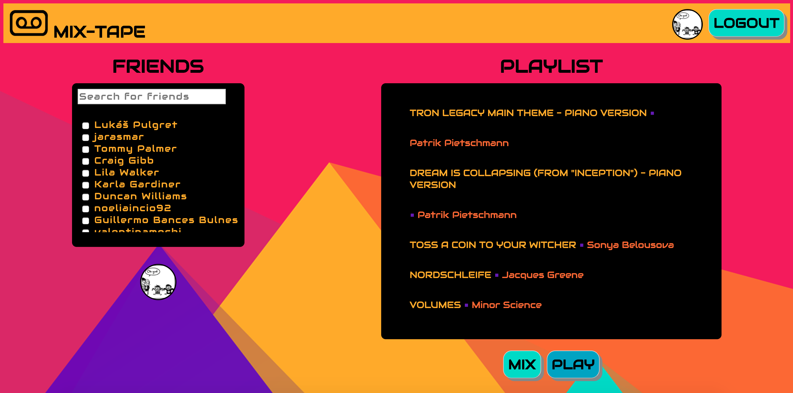

# Mix Tape

Makers Final Project



Contributors: [Karla Gardiner](https://github.com/KG700), [Lila Walker](https://github.com/lilawalker), [Jara Santamaria Martinez](https://github.com/jarasmar), [Sophia Bell](https://github.com/Kittaru87)

Checkout our app at https://mix-tape-makers.herokuapp.com/signin

[Specification](#Specification) | [Planning](#Planning) | [Installation Instructions](#Installation-instructions) | [Running Tests](#Running-tests) | [Tech Stack](#Tech-stack) | [Challenges](#challenges) | [Further Development](#Further-development)

## Specification
To build an app using React and Rails that combines selected users' top tracks in Spotify to create a new playlist that then plays in the browser.

## Planning

**Step 1: Agree on a concept**

We had many ideas that we fleshed out together including a virtual pub, an upcycling map, Spotify playlist generator, London air quality changes and a social media stream manager. Our project brief was to work with APIs to pull in and manipulate data, but we were also keen to learn how to use React and develop a product that was tangible and could be used by anyone. We eventually decided to work with the Spotify API, as the data set was large and clean, and we would be able to work towards something we could all see ourselves using. It became clear from the beginning that we would need a backend in order to store user's top songs as Spotify, for security reasons, does not allow you to pull other user's data. We therefore settled on a Rails backend and a React frontend.

**Step 2: Agree an MVP**

We decided that our MVP would consist of a login (which would authenticate the user and allow us to pull their top tracks from Spotify), the ability to select yourself (and maybe one other) and see your top tracks, and a button that would save these tracks as a new playlist into Spotify.

We also planned out the initial steps for our MVP, as well as agreeing a Team Charter, what our daily roles would be and various agile process timings, such as stand-ups, check-ins and retros.

*User stories*
```
As a user
So that I can collaborate my music with friends
I would like to sign up to Mix Tape with my Spotify account

As a user
So that I can mix my top songs with my friends' top songs
I would like to select my friends from a list of users

As a user
So that I can reshuffle our collaborated playlist
I would like to mix until I am happy with my playlist

As a user
So that I can listen our collaborated songs
I would like to play to the playlist in the Spotify player

As a user
So that I can generate a new playlist
I would like to go back to select new friends

As a user
So that I can be sure my account is secure
I would like to log out using my Spotify account
```

**Step 3: Set up**

Working with Rails and React, we decided to install the two together from the beginning, rather than importing React at a later date. We made sure that our initial testing framework, rspec, along with our linting tools, simplecov and rubocop, were installed from the get go as well. We also agreed to set up our user database together so that we were familiar with the form our backend would take before we started working in pairs. We decided that it was best practice to all start from the same solid foundation - our database is set up using postgreSQL rather than the standard sqlite that comes with Rails as we were more familiar with the former. Once set up we all did some individual research on using React and other areas that we were unfamiliar with and placed resources that we found to be informative in the learning resources section of our Trello board.

Our full plan can be found on our [Trello board](https://trello.com/b/cjZHXYTp/mix-tape-final-project)

## Installation instructions

### Getting Started

Clone the repo and navigate to the project root directory:

```
$ git clone https://github.com/KG700/mix-tape.git
$ cd mix-tape
```

### Dependencies

Install Bundler and Yarn if you don't already have it.

To install dependencies:

```
$ bundle install
$ yarn install
```
This project relies on the following dependencies:

- Rspec (for testing the backend)
- Rubocop (for linting on the backend)
- SimpleCov (for test coverage on the backend)
- Foreman (for running the webserver)
- Better Errors & Binding of Caller (for better errors!)
- Rspotify (for Spotify authentication)
- ESLint (for linting on the frontend)
- Jest (for testing on the frontend)
- React Testing Framework (for testing on the frontend)

### Set up the DataBase

Install Postgresql if you don't already have it.

To setup the database:

```
$ rails db:create
$ rails db:migrate
```

Congratulations! Your database is now setup!

### Setup your Spotify App

Create a Spotify account if you don't already have one. You can use a free or premium account.

Go to the [Spotify Dashboard](https://developer.spotify.com/dashboard/login) website and crete a new app.

This will generate a Client ID and Client Secret.

In your root directory create a `.env` file and place the ids in the file as follows:

```
SPOTIFY_CLIENT_ID='<your client id here>'
SPOTIFY_CLIENT_SECRET='<your client secret here>'
```

This file is added to the .gitignore file so that the secret ids are not pushed to GitHub for everyone to see and use.

### Run the Application

In your terminal run:

```
$ rails server
```

Then navigate to `localhost:3000/signin` in your browser

## Running tests

To run the tests, make sure you are in the root of the project and run:

```
$ bundle exec rspec
$ bundle exec rubocop
$ jest
```

## Tech stack
- Ruby on Rails
- React

## Challenges

* Spotify authentication and scopes
* Rails environmental variables
* Learning and understanding React and how it fits together with Rails
* Generating a playlist shows the previous playlist generated because of get/post request order issue.
* Deployment to Heroku - adding environmental variables to Heroku and changing the procfile to profile.dev

## Further development

* Chat function that would allow you to listen and chat about the playlist you had just created with the people whose music you had chosen
* Other song filtering options that the user could select, instead of just their top 50 tracks
* Other options for the user such as selecting the size of their playlist
* Option to email the link of your new playlist to the people who had contributed to it
* Mobile option
* Profile page
